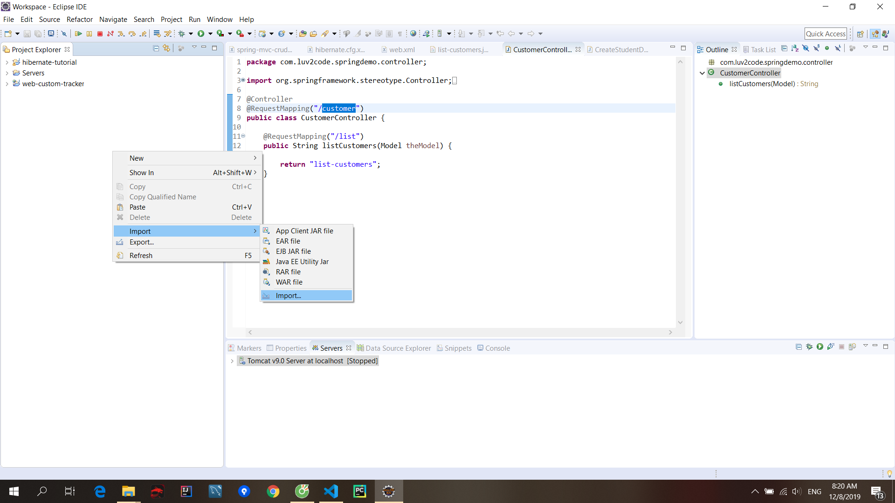
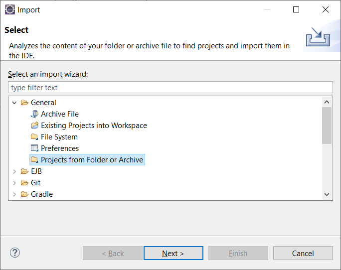
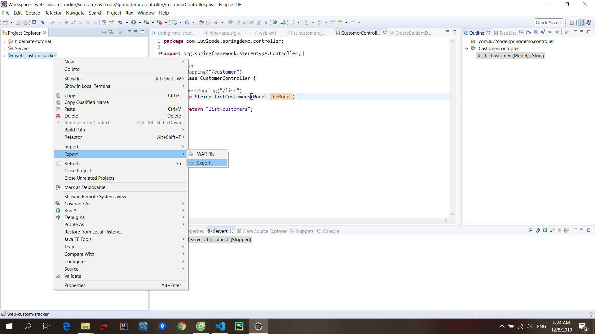
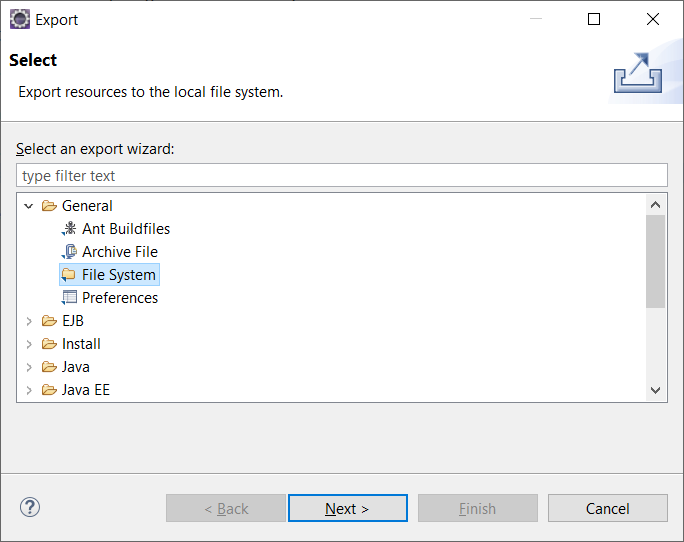
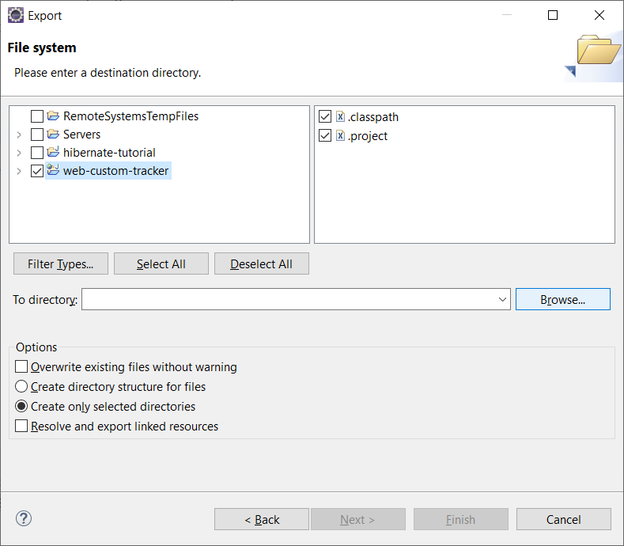
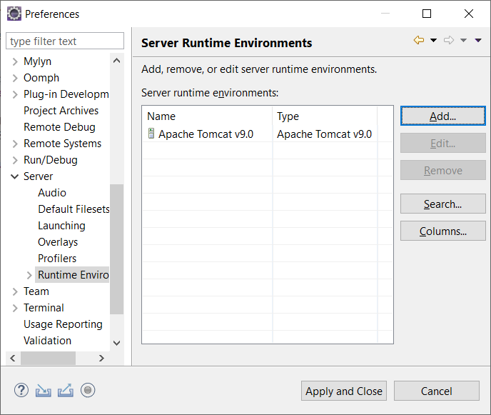
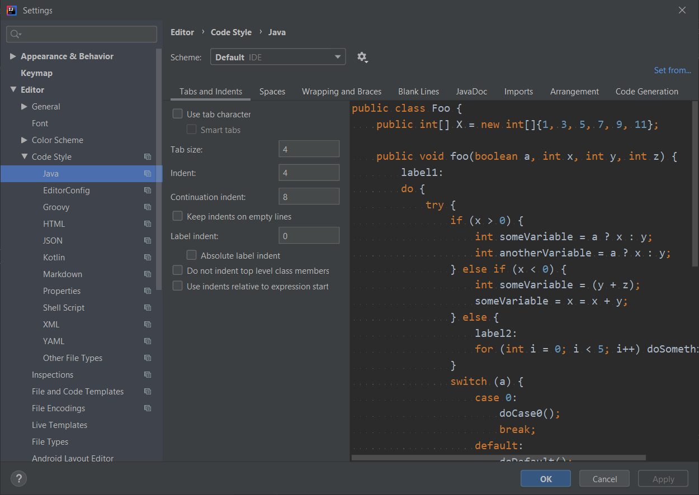
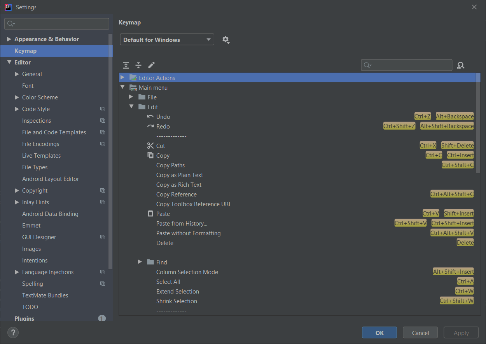

### How to Import Project Files.html

https://www.youtube.com/watch?v=fiuSckgjdmY&feature=youtu.be

#### Import

File/ Open project from file system../ Directory

#### Export

Browse
  
Finish

### Add new server

Click on tab server/ create new server

### Videos for Java and IDE installation on MAC and Linux.html

Hey Friend,

Here are few suggested videos for setup different IDE, Java on different operating systems. The following videos are on YouTube and StudyEasy is not associated the the video makers.

How to install Java JDK on Mac OS X ( with JAVA_HOME )
Link: https://www.youtube.com/watch?v=y6szNJ4rMZ0

How to Install Eclipse IDE on Mac OS X
Link: https://www.youtube.com/watch?v=gufMbpxzfWw

How to Install Intellij IDEA on Mac OS X + Creating First Hello World Java Application
Link: https://www.youtube.com/watch?v=8BrZ7CMrNe8

How to install Java JDK 10 on Ubuntu 18.04 LTS (Debian Linux)
Link: https://www.youtube.com/watch?v=4RJ60fqeTN4

How to Install Eclipse Oxygen on Ubuntu 16.04 / Ubuntu 18.04 (Linux)
Link: https://www.youtube.com/watch?v=EiGl2Ag35AI

Installing Jetbrains Intellij IDEA on Ubuntu and Creating First Hello World
Link: https://www.youtube.com/watch?v=VBkjXV1aSRA

### Import eclipse project on IntelliJ

### Intellij idea set tab key to 4 spaces

http://www.programmersought.com/article/2072376281/
From the diagram above, instead of "Tools", select "Editor" > "Code Style" > [Pick a file type] ...then you will see your settings.

### Inteliji

ctr+alt+shift+L -> reformat whole file
CTRL SHIFT A => Action: To space
If you want to apply the changes just to the current file

- Option 1: You can choose in the navigation bar: Edit -> Convert Indent -> To Spaces. (see image below)

To view the keymap configuration, open the Settings/Preferences dialog Ctrl+Alt+S and select Keymap.

https://www.jetbrains.com/help/idea/configuring-keyboard-and-mouse-shortcuts.html

### MAVEN

https://books.sonatype.com/m2eclipse-book/reference/index.html
