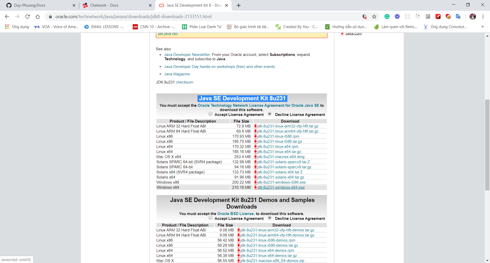
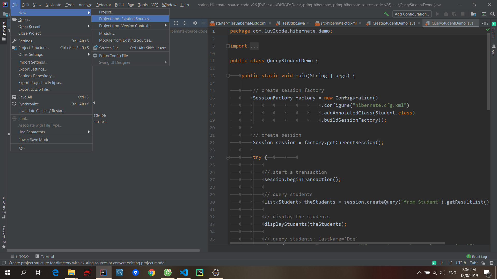

MUC LUC

## 1. Introduction Background

https://www.udemy.com/course/full-stack-java-developer-java/

### 3.2 01.01. History of Java.html

https://studyeasy.org/java/history-of-java/
File pdf

### 4. Review and rating

## 2. Java Setting up

### 1. Download process and installation of Java (Windows)

GG: download jdk
https://www.oracle.com/technetwork/java/javase/downloads/index.html
Java SE Development Kit 8u231


### 2. Download and installation process of Eclipse

GG: eclipse
Download package
Eclipse for java EE
download file zip

### 3. A short message

## 3. Java Getting started

### 1. The language of 50 keywords

### 1.1 03.01. 50 Keywords of Java.html

### 2. Our first Java program

### 2.1 03.02. Our First Java Program.html

### 3. Variable and datatype

### 3.1 03.03. Variable and Data Type.html

### 4. Understanding variables

### 4.1 03.04. Understanding Variables in Java.html

### 5. Primitive Data Types (Integer datatype)

### 5.1 03.05. Primitive data types.html

### 6. Primitive Data Types (floating point datatype)

### 6.1 03.05. Primitive Data Types.html

### 7. Primitive Data Types (boolean and char)

### 7.1 03.05. Primitive Data Types.html

### 8. BigDecimal class introduction

Use to get exactly value

```java
BigDecimal d1 = BigDecimal(1.233);
BigDecimal d2 = BigDecimal(1.233);
sout(d1.add(d2));
```

### 9. String basics

### 9.1 09.18. Strings in Java.html

### 10. Type casting

### 10.1 03.06. Type Casting.html

### 11. EXERCISE - Solve an equation

### 12. When to use what

### 13. Quiz on section 3.html

### 14. Project files.html

## 4. Java Some good to know information

### 1. Videos from this section

### 2. Understand Udemy interface and how to get completion certificate

### 3. Project files and downloadable material and articles

### 4. How to Import Project Files.html

https://www.youtube.com/watch?v=fiuSckgjdmY&feature=youtu.be

### 5. Videos for Java and IDE installation on MAC and Linux.html

Hey Friend,

Here are few suggested videos for setup different IDE, Java on different operating systems. The following videos are on YouTube and StudyEasy is not associated the the video makers.

How to install Java JDK on Mac OS X ( with JAVA_HOME )
Link: https://www.youtube.com/watch?v=y6szNJ4rMZ0

How to Install Eclipse IDE on Mac OS X
Link: https://www.youtube.com/watch?v=gufMbpxzfWw

How to Install Intellij IDEA on Mac OS X + Creating First Hello World Java Application
Link: https://www.youtube.com/watch?v=8BrZ7CMrNe8

How to install Java JDK 10 on Ubuntu 18.04 LTS (Debian Linux)
Link: https://www.youtube.com/watch?v=4RJ60fqeTN4

How to Install Eclipse Oxygen on Ubuntu 16.04 / Ubuntu 18.04 (Linux)
Link: https://www.youtube.com/watch?v=EiGl2Ag35AI

Installing Jetbrains Intellij IDEA on Ubuntu and Creating First Hello World
Link: https://www.youtube.com/watch?v=VBkjXV1aSRA

### 6. IntelliJ Installation and hello world program in IntelliJ

Xem lai!!

### 7. Import eclipse project on IntelliJ



## 5. Java Decision making under Java

### 1. Arithmetic operators

### 1.1 04.01. Arithmetic Operators.html

### 2. Making decision with operators - Part 1

### 2.1 04.01. Arithmetic Operators.html

### 3. Making decision with operators - Part 2

### 3.1 04.01. Arithmetic Operators.html

### 4. Making decision with operators - Part 3

### 4.1 04.01. Arithmetic Operators.html

### 5. Ternary operator

### 5.1 04.02. Ternary Operator in Java.html

### 6. Assignment operators

### 6.1 04.03. Assignment Operators.html

### 7. Making decision with if else

### 7.1 04.04. Making Decision with If- Else.html

### 8. Exercise.html

### 9. Project files.html

### 10. Quiz on section 5.html

## 6. Java Flow control

### 1. Switch case - Part 1

### 1.1 05.01. Switch case.html

### 2. Switch case - Part 2

### 2.1 05.01. Switch case.html

### 3. Switch case - Part 3

### 3.1 05.01. Switch case.html

### 4. For loop

### 4.1 05.02. For loop.html

### 5. For loop (Number is prime or not)

### 6. While loop

### 6.1 05.03. While Loop.html

### 7. Do while loop

### 7.1 05.04. Do while loop.html

### 8. Loops Revisited

### 9. Break and continue

### 9.1 05.05. Break and continue statement.html

### 10. Nested loops

### 10.1 05.06. Nested Loops.html

### 11. Nested loops - exercise

### 11.1 05.06. Nested Loops.html

### 12. Quiz on section 6.html

### 13. Modulo operator (Bonus)

### 14. Sum Of digit solution (Bonus)

Tinh tong cac chu so cua 1 so

### 15. Project files.html

## 7. Java Methods

### 1. Methods

### 1.1 06.01. Methods in Java.html

### 2. Methods parameters and return type

### 2.1 06.01. Methods in Java.html

### 3. Method overloading - Part 1

### 4. Method overloading - Part 2

### 5. EXERCISE on method

### 6. Project files.html

### 7. Quiz on Section 7.html

## 8. Java Some good information

### 1. Naming convention

### 2. Code Block, Indentation and statements

Xem lai

### 3. Java literals.html

### 4. Quiz on section 8.html

## 9. Java Object Oriented Programming Concepts

### 1. Classes - Introduction

### 1.1 08.01. Classes overview.html

### 2. Classes - Getters and setters introduction

### 2.1 08.01. Classes overview.html

### 3. Classes - Getters and setters

### 3.1 08.01. Classes overview.html

### 4. Classes - Adding functionality into class

### 4.1 08.01. Classes overview.html

### 5. Constructors Introduction

### 5.1 08.02. Constructor Overview.html

### 6. Default constructor

### 6.1 08.02. Constructor Overview.html

### 7. Usage of constructors

### 7.1 08.02. Constructor Overview.html

### 8. Understanding inheritance

### 8.1 08.03. Understanding Inheritance.html

### 9. Working with inheritance - Part 1

### 9.1 08.04. Working with Inheritance.html

### 10. Working with inheritance - Part 2

### 10.1 08.04. Working with Inheritance.html

### 11. Working with inheritance - Part 3

### 11.1 08.04. Working with Inheritance.html

### 12. Working with inheritance - Part 4

### 12.1 08.04. Working with Inheritance.html

### 13. Working with inheritance - Part 5

### 13.1 08.04. Working with Inheritance.html

### 14. Type of inheritance - Exercise information

### 15. EXERCISE explanation (inheritance)

### 16. Composition Introduction

### 16.1 08.05. Composition.html

### 17. Composition Setting up

### 17.1 08.05. Composition.html

### 18. Working with composition

### 18.1 08.05. Composition.html

### 19. Adding functionality

### 20. Encapsulation - Part 1

### 20.1 08.10. Encapsulation.html

### 21. Encapsulation - Part 2

### 21.1 08.10. Encapsulation.html

### 22. Polymorphism - Part 1

### 22.1 08.11. Polymorphism.html

### 23. Polymorphism - Part 2

### 23.1 08.11. Polymorphism.html

### 24. Benefits of Polymorphism

loop and print value from parent class don't care about type of child class

### 25. Project files.html

### 26. Quiz on section 9.html

## 10. Java Core concepts

### 1. Interfaces

### 1.1 08.12. Interfaces.html

### 2. Abstract class - Introduction

### 2.1 09.01. Abstract Classes.html

### 3. Multiple inheritance using interfaces

### 3.1 09.02. Multiple Inheritance Using Interfaces.html

### 4. Inner classes

### 4.1 09.03. Inner Classes.html

### 5. Types of nested class

Static nested inner class
Non-static nested inner class

- Local inner class
- Member inner class
- Anonymous inner class

### 5.1 09.04. Types of Nested Class.html

### 6. Local inner class

### 6.1 09.05. Local Inner Class.html

### 7. Anonymous object

### 7.1 09.06. Anonymous Object.html

### 8. Anonymous inner class

### 8.1 09.07. Anonymous Inner class.html

### 9. Advantages of inner class

### 9.1 09.08. Advantage of Inner Class.html

### 10. User input

### 10.1 09.09. User Input.html

### 11. Static elements

### 11.1 09.10. Static Elements and Inner Class.html

### 12. Static inner class - Part 1

### 13. Static inner class - Part 2

### 13.1 09.10. Static Elements and Inner Class.html

### 14. Final keyword

### 14.1 09.12. Final Keyword.html

### 15. Final keyword with method and class

### 15.1 09.12. Final Keyword.html

### 16. Packages

### 16.1 09.13. Packages.html

### 17. Packages continues

### 17.1 09.13. Packages.html

### 18. Scope

### 18.1 09.14. Scope.html

### 19. Access modifier

### 19.1 09.15. Access Modifier.html

### 20. Access modifier - Part 1

### 20.1 09.15. Access Modifier.html

### 21. Access modifier - Part 2

### 21.1 09.15. Access Modifier.html

### 22. Exception handling (Intro)

### 22.1 09.16. Exception Handling.html

### 23. Exception handling, Multiple catch blocks

### 23.1 09.16. Exception Handling.html

### 24. Exception handling, Multiple catch blocks - Part 2

### 24.1 09.16. Exception Handling.html

### 25. Finally block

### 25.1 09.19. Finally block.html

### 26. Throw and throws

### 26.1 09.20. Throw and Throws.html

### 27. User defined exception

### 27.1 09.21. User Defined Exception.html

### 28. Checked and unchecked exceptions

### 28.1 09.22. Checked and Unchecked Exceptions.html

### 29. Enum

### 29.1 09.23. Enum in Java.html

### 30. Enum continues

### 31. Strings

### 31.1 09.18. Strings in Java.html

### 32. Difference between String literal and String Object

### 33. String methods (Document).html

### 34. String formatting (Document).html

### 35. Project files.html

### 36. Quiz on section 10.html

## 11. Java Array

### 1. Array overview

### 1.1 10.01. What's an Array.html

### 2. How to initialize array

### 2.1 10.01. What's an Array.html

### 3. Foreach loop

### 3.1 10.01. What's an Array.html

### 4. Methods - Call by value and reference

### 4.1 10.03. Method Call by Value and Reference.html

### 5. Quiz on section 11.html

### 6. Note.html

### 7. Issues with array

### 7.1 10.04. Issues with Array.html

### 8. About Test and improve your Java Skills

### 9. Project files.html

## 12. Java Collections framework

### 1. Collections framework Overview

### 1.1 11.03. Collections Framework Overview.html

### 2. ArrayList

### 2.1 11.01. ArrayList.html

### 3. ArrayList - Part 2

### 3.1 11.01. ArrayList.html

### 4. Autoboxing and unboxing

### 4.1 11.02. Autoboxing and Unboxing.html

### 5. ArrayList and Stack overview

### 5.1 11.04. ArrayList and Stack Overview.html

### 6. Stack methods

### 6.1 11.05. Stack Methods.html

### 7. LinkedList

### 7.1 11.06. LinkedList.html

### 8. LinkedList operations

### 8.1 11.07. LinkedList Operations.html

### 9. List interface

### 9.1 11.08. List Interface.html

### 10. Iterators

### 10.1 11.09. Iterators.html

### 11. Sorting and reversal of elements

### 12. CompareTo method overview

### 12.1 11.11. Compare To Method Overview.html

### 13. Comparable interface

### 13.1 11.12. Comparable Interface.html

### 14. Understanding bit more of it

### 14.1 11.13.Understanding bit more of it.html

### 15. Project files.html

## 13. Java Generics

### 1. Generics overview

### 2. Getting started with generics

### 3. Understanding generics

### 4. Type parameters

### 5. Type parameters (Document).html

### 6. Generic method

### 7. Bounded type parameter

### 8. Comparable interface

### 9. Wildcards in Generics

### 10. Project files.html

## 14. Java Collections continues

### 1. Sets

### 2. Set types

### 3. Custom sorting using comparator

### 4. Queue

### 5. Dequeue

### 6. Maps

### 7. TreeMap

### 8. Equals and hashcode methods

### 9. Search under Maps

### 10. Something more

### 11. Project files.html

## 15. Java Multi-threading-Concurrency control in Java

### 1. About multi-threading

### 2. Multithreading overview

### 3. Creating thread by extending the thread class

### 4. Creating thread by implementing runnable interface

### 5. Synchronization under concurrency control

### 6. Synchronized method

### 7. Synchronized block

### 8. Synchronized block on object

### 9. Static synchronization

### 10. Usage of volatile keyword

### 11. Wait and notify

### 12. Interrupt

### 13. Join overview

### 14. Thread pools

### 15. CountDownLatch

### 16. Blocking Queue

### 17. Reentrant lock

### 18. Deadlock - Part 1

### 19. Deadlock - Part 2

### 20. Project files.html

## 16. Java Lambda expression - basics

### 1. Lambda expression overview

### 2. Lambda expression continued

### 3. Lambda expressions, something more

### 4. Lambda expressions, few more things

### 5. Lambda expressions with variables and iterations

### 6. Predicates

### 7. Predicates something more

### 8. Project files.html

## 17. Java File Handling under Java

### 1. Data streams

### 2. Creating file on disk

### 3. Creating a directory

### 4. Writing onto files

### 5. Reading files with BufferedReader

### 6. Reading files with scanner

### 7. Scanner vs Buffered reader

### 8. File deletion

### 9. Try with resources

### 10. Serialization of Objects

### 11. Project files.html

### 12. Quiz on section 17.html

## 18. Debug Debugging

### 1. Getting started with debugging

### 2. Debugging, runtime variable value update

### 3. Debugging Continues

### 4. How to apply watch on variable(s)

## 19. GIT GIT basics

### 1. Before we go further

### 2. GIT overview

### 3. GIT features overview

### 4. Setting up GIT

### 5. Clone and import GIT project into eclipse

### 6. Clone GIT project directly from eclipse

## 20. JSP & Servlets Introduction

### 1. Before we start with Jsp and Servlets

### 2. Requirements to get started

### 3. Project setup

### 4. Hello Servlets

Config build path/ Add external jar/ Vào link C:\Program Files\Apache Software Foundation\Tomcat 9.0\lib chọn servlet-api.jar là project sẽ hết lỗi khi import
http://localhost:8080/Hello_Servlets/HelloWorld

HelloWorld la servlet name
Hello_Servlets la ten project

co the thay doan sau bang ten file html hay jsp trong Webcontent

```java
package org.studyeasy.servlets;

import java.io.IOException;
import javax.servlet.ServletException;
import javax.servlet.annotation.WebServlet;
import javax.servlet.http.HttpServlet;
import javax.servlet.http.HttpServletRequest;
import javax.servlet.http.HttpServletResponse;

/**
 * Servlet implementation class HelloWorld
 */
@WebServlet("/HelloWorld")
public class HelloWorld extends HttpServlet {
	private static final long serialVersionUID = 1L;

	/**
	 * Default constructor.
	 */
	public HelloWorld() {
		// TODO Auto-generated constructor stub
	}

	/**
	 * @see HttpServlet#doGet(HttpServletRequest request, HttpServletResponse
	 *      response)
	 */
	protected void doGet(HttpServletRequest request, HttpServletResponse response)
			throws ServletException, IOException {
		response.getWriter().println("<h1>Hello World</h1>");
	}

}

```

### 5. Hello JSP

Create file jsp in WebContent

### 6. Servlets life cycle

https://www.javatpoint.com/life-cycle-of-a-servlet

1. Servlet class is loaded.
2. Servlet instance is created.
3. init method is invoked.
4. service method is invoked.
5. destroy method is invoked.

### 7. JSP expressions element

```jsp
<body>
<h1>HELLO JSP</h1>

<%= new java.util.Date()  %>
<br/>
<%= 25*4 %>
<br/>
<%= 25>4 %>
</body>
```

### 8. JSP scriptlets element

```jsp
<%
for(int i=0;i<10;i++){
	out.print("<br/>");
	out.print(i);
}
%>
```

### 9. JSP declarations element

```jsp
<%!
    String message(){
	return "I love JSP";
}
%>

<%= message() %>

```

### 10. JSP comment element

```jsp
 	<%-- 	response.sendRedirect("http://studyeasy.org");	--%>

```

### 11. JSP Directive element

### 12. Deployment descriptor and annotations

Nếu sử dụng annotation @WebServlet("/HelloWorld") thì Không cần sử dụng file web.xml
Base URL sẽ chứa cả /HelloWorld

If you don't use annotation
S01L12 - Deloyment Descriptor

```xml
<?xml version="1.0" encoding="UTF-8"?>
<web-app xmlns:xsi="http://www.w3.org/2001/XMLSchema-instance" xmlns="http://java.sun.com/xml/ns/javaee" xsi:schemaLocation="http://java.sun.com/xml/ns/javaee http://java.sun.com/xml/ns/javaee/web-app_2_5.xsd" id="WebApp_ID" version="2.5">
  <display-name>S01L12 - Deloyment Descriptor</display-name>
  <welcome-file-list>
    <welcome-file>index.html</welcome-file>
    <welcome-file>index.htm</welcome-file>
    <welcome-file>index.jsp</welcome-file>
    <welcome-file>default.html</welcome-file>
    <welcome-file>default.htm</welcome-file>
    <welcome-file>default.jsp</welcome-file>
  </welcome-file-list>
  <servlet>
    <description></description>
    <display-name>Demo</display-name>
    <servlet-name>Demo</servlet-name>
    <servlet-class>org.studyeasy.servlet.Demo</servlet-class>
  </servlet>
  <servlet-mapping>
    <servlet-name>Demo</servlet-name>
    <url-pattern>/TESTING</url-pattern>
  </servlet-mapping>
</web-app>
```

### 13. JSP configuration in deployment descriptor

```xml
<?xml version="1.0" encoding="UTF-8"?>
<web-app xmlns:xsi="http://www.w3.org/2001/XMLSchema-instance" xmlns="http://java.sun.com/xml/ns/javaee" xsi:schemaLocation="http://java.sun.com/xml/ns/javaee http://java.sun.com/xml/ns/javaee/web-app_2_5.xsd" id="WebApp_ID" version="2.5">
  <display-name>S01L12 - Deloyment Descriptor</display-name>
  <welcome-file-list>
    <welcome-file>index.html</welcome-file>
    <welcome-file>index.htm</welcome-file>
    <welcome-file>index.jsp</welcome-file>
    <welcome-file>default.html</welcome-file>
    <welcome-file>default.htm</welcome-file>
    <welcome-file>default.jsp</welcome-file>
  </welcome-file-list>
  <servlet>
    <description></description>
    <display-name>Demo</display-name>
    <servlet-name>Demo</servlet-name>
    <servlet-class>org.studyeasy.servlet.Demo</servlet-class>
  </servlet>
  <servlet-mapping>
    <servlet-name>Demo</servlet-name>
    <url-pattern>/TESTING</url-pattern>
  </servlet-mapping>


    <servlet>
    <description></description>
    <display-name>Hello JSP</display-name>
    <servlet-name>Hello JSP</servlet-name>
    <!-- Add new -->
    <jsp-file>/HelloJSP.jsp</jsp-file>
  </servlet>
  <servlet-mapping>
    <servlet-name>Hello JSP</servlet-name>
    <url-pattern>/HelloJspPatternTEST</url-pattern>
    </servlet-mapping>
</web-app>


```

Right click file HelloJSP.jsp va chon Run on Server

### 14. Reading URL parameter(s)

```java
protected void doGet(HttpServletRequest request, HttpServletResponse response)
			throws ServletException, IOException {
		// response.getWriter().print(request.getParameter("getValue1"));
		PrintWriter out = response.getWriter();
		out.println("Value 1: "+request.getParameter("getValue1"));
		out.println("Value 2: "+request.getParameter("getValue2"));

	}
```

http://localhost:8080/S01L14/ParameterServlet?getValue1=1&getValue2=5
or right click file jsp
http://localhost:8080/S01L14/parameter.jsp?getValue1=1&getValue2=5

file parameter.jsp

```jsp
<%

out.println("Value 1: "+request.getParameter("getValue1"));
out.println("Value 2: "+request.getParameter("getValue2"));

%>
```

### 15. Include file(s) in JSP page

- Create file .txt in WebContent
- use `<%@ include file="a.txt" %>`

In file jsp

```html
<!-- For adding static content -->
<%@ include file="file1.txt" %>
<br />
<!-- For adding dynamic content -->
<jsp:include page="file2.txt" />
```

http://localhost:8080/S01L15/JSPFile.jsp

### 16. Import class into Jsp page

```jsp
<%@ page import="java.util.Date,org.studyeasy.UserDefined"%> <%@ page
language="java" contentType="text/html; charset=ISO-8859-1"
pageEncoding="ISO-8859-1"%>

<!DOCTYPE html PUBLIC "-//W3C//DTD HTML 4.01 Transitional//EN" "http://www.w3.org/TR/html4/loose.dtd">
<html>
  <head>
    <meta http-equiv="Content-Type" content="text/html; charset=ISO-8859-1" />
    <title>Jsp File</title>
  </head>
  <body>
    <%=new Date()%>
    <br />
    <% out.print(new UserDefined().Demo()); %>
  </body>
</html>
```

### 17. Forward and redirect under JSP

```jsp
It's from the original page <%
//request.getRequestDispatcher("forward.jsp").forward(request, response);
response.sendRedirect("redirect.jsp"); %>
```

Co the Sd
<jsp:forward page="abc.jsp"></jsp:forward>

### 18. MVC overview

### 19. Exercise - Basic redirection using servlet

### 20. Basic application based on MVC

Config web.xml file

```xml
<?xml version="1.0" encoding="UTF-8"?>
<web-app xmlns:xsi="http://www.w3.org/2001/XMLSchema-instance" xmlns="http://java.sun.com/xml/ns/javaee" xsi:schemaLocation="http://java.sun.com/xml/ns/javaee http://java.sun.com/xml/ns/javaee/web-app_2_5.xsd" id="WebApp_ID" version="2.5">
  <display-name>Demo</display-name>
  <welcome-file-list>
    <welcome-file>index.html</welcome-file>
    <welcome-file>index.htm</welcome-file>
    <welcome-file>index.jsp</welcome-file>
    <welcome-file>default.html</welcome-file>
    <welcome-file>default.htm</welcome-file>
    <welcome-file>default.jsp</welcome-file>
  </welcome-file-list>
  <servlet>
    <description></description>
    <display-name>Controller</display-name>
    <servlet-name>Controller</servlet-name>
    <servlet-class>org.studyeasy.servlet.Controller</servlet-class>
  </servlet>
  <servlet-mapping>
    <servlet-name>Controller</servlet-name>
    <url-pattern>/Controller</url-pattern>
  </servlet-mapping>
</web-app>
```

index.jsp

```jsp
<%@ page language="java" contentType="text/html; charset=ISO-8859-1"
    pageEncoding="ISO-8859-1"%>
<!DOCTYPE html PUBLIC "-//W3C//DTD HTML 4.01 Transitional//EN" "http://www.w3.org/TR/html4/loose.dtd">
<html>
<head>
<meta http-equiv="Content-Type" content="text/html; charset=ISO-8859-1">
<title>Home</title>
</head>
<body>
It's home <br/>
<a href="<%=request.getContextPath() %>/Controller?page=login">Login</a><br/>
<a href="<%=request.getContextPath() %>/Controller?page=signup">Sigh Up</a><br/>
<a href="<%=request.getContextPath() %>/Controller?page=about">About</a><br/>

</body>
</html>
```

Controller

```java
package org.studyeasy.servlet;

import java.io.IOException;
import javax.servlet.ServletException;
import javax.servlet.http.HttpServlet;
import javax.servlet.http.HttpServletRequest;
import javax.servlet.http.HttpServletResponse;

/**
 * Servlet implementation class Controller
 */
public class Controller extends HttpServlet {
	private static final long serialVersionUID = 1L;

	/**
	 * @see HttpServlet#HttpServlet()
	 */
	public Controller() {
		super();
		// TODO Auto-generated constructor stub
	}

	/**
	 * @see HttpServlet#doGet(HttpServletRequest request, HttpServletResponse
	 *      response)
	 */
	protected void doGet(HttpServletRequest request, HttpServletResponse response)
			throws ServletException, IOException {
		String param = request.getParameter("page");
		if(param.equals("login")){
			getServletContext().getRequestDispatcher("/login.jsp").forward(request, response);
		}else if(param.equals("signup")){
			getServletContext().getRequestDispatcher("/signUp.jsp").forward(request, response);
		}else if(param.equals("about")){
			getServletContext().getRequestDispatcher("/about.jsp").forward(request, response);
		}else {
			getServletContext().getRequestDispatcher("/notFound.jsp").forward(request, response);
		}


	}

}


```

http://localhost:8080/S01L20/index.jsp

### 21. Project files.html

## 21. JSP & Servlets Forms

### 1. Forms overview

### 2. Form elements (Document).html

Tag

Description

```html
<input>

Defines an input control for the form

<textarea>

Defines   a multiline(text area) input control for the form

<label>

Defines a label for an <input> element for   the form

<fieldset>

Groups   related elements in a form for the form

<legend>

Defines a caption for a <fieldset> element   for the form

<select>

Defines   a drop-down list for the form

<optgroup>

Defines a group of related options in a drop-down   list for the form

<option>

Defines   an option in a drop-down list for the form

<button>

Defines a clickable button

```

### 3. Forms under JSP

6.1 Section2.zip.zip
Create file form.jsp

```jsp
<%@ page language="java" contentType="text/html; charset=ISO-8859-1"
    pageEncoding="ISO-8859-1"%>
<!DOCTYPE html PUBLIC "-//W3C//DTD HTML 4.01 Transitional//EN" "http://www.w3.org/TR/html4/loose.dtd">
<html>
<head>
<meta http-equiv="Content-Type" content="text/html; charset=ISO-8859-1">
<title>Form demo</title>
</head>
<body>
<form action="submit.jsp" method="post">
   Full name: <input type="text" name="name"/><br/>
   Gender: <input type="radio" name="gender" value="male"> Male
           <input type="radio" name="gender" value="female"> Female <br/>
  Languages know: <input type="checkbox" name="language" value="English"> English
  				  <input type="checkbox" name="language" value="Hindi"> Hindi
  				  <input type="checkbox" name="language" value="French"> French <br/>
  Country: <select name="country">
           <option value="India">India</option>
   		   <option value="USA">USA</option>
   		   <option value="UK">UK</option>
   		   <option value="Finland">Finland</option>
   		   <option value="Fiji">Fiji</option>
         </select><br/>
         <input type="submit" value="Submit">
</form>

</body>
</html>

```

submit.jsp

```jsp
<%@ page language="java" contentType="text/html; charset=ISO-8859-1"
    pageEncoding="ISO-8859-1"%>
<!DOCTYPE html PUBLIC "-//W3C//DTD HTML 4.01 Transitional//EN" "http://www.w3.org/TR/html4/loose.dtd">
<html>
<head>
<meta http-equiv="Content-Type" content="text/html; charset=ISO-8859-1">
<title>Submit</title>
</head>
<body>
Name: <%= request.getParameter("name") %><br/>
Gender: <%= request.getParameter("gender") %><br/>
Languages known: <%
String[] countries = request.getParameterValues("language");
if(countries != null){
	for(int i=0; i<countries.length;i++){
		out.print("<br/>");
	   out.print(countries[i]);

	}
}else{
	out.print("None Selected");
}

%><br/>


Country: <%= request.getParameter("country") %>
</body>
</html>
```

Neu sua post thanh get thi value se hien thi tren url

### 4. Forms under Servlets

File jsp

```jsp

<form action="<%=request.getContextPath()%>/Controller" method="get">
   Full name: <input type="text" name="name"/><br/>
   Gender: <input type="radio" name="gender" value="male"> Male
           <input type="radio" name="gender" value="female"> Female <br/>
  Languages know: <input type="checkbox" name="language" value="English"> English
  				  <input type="checkbox" name="language" value="Hindi"> Hindi
  				  <input type="checkbox" name="language" value="French"> French <br/>
  Country: <select name="country">
           <option value="India">India</option>
   		   <option value="USA">USA</option>
   		   <option value="UK">UK</option>
   		   <option value="Finland">Finland</option>
   		   <option value="Fiji">Fiji</option>
         </select><br/>
         <input type="submit" value="Submit">
</form>

```

File Controller

```java
package org.studyeasy.servlet;

import java.io.IOException;
import java.io.PrintWriter;

import javax.servlet.ServletException;
import javax.servlet.annotation.WebServlet;
import javax.servlet.http.HttpServlet;
import javax.servlet.http.HttpServletRequest;
import javax.servlet.http.HttpServletResponse;

/**
 * Servlet implementation class Controller
 */
@WebServlet("/Controller")
public class Controller extends HttpServlet {
	private static final long serialVersionUID = 1L;

	/**
	 * @see HttpServlet#HttpServlet()
	 */
	public Controller() {
		super();
		// TODO Auto-generated constructor stub
	}

	/**
	 * @see HttpServlet#doGet(HttpServletRequest request, HttpServletResponse
	 *      response)
	 */
	protected void doGet(HttpServletRequest request, HttpServletResponse response)
			throws ServletException, IOException {
		response.getWriter().println(request.getParameter("name") + "<br/>");
		response.getWriter().println(request.getParameter("gender") + "<br/>");

		PrintWriter out = response.getWriter();
		String[] countries = request.getParameterValues("language");
		if (countries != null) {
			for (int i = 0; i < countries.length; i++) {

				out.print(countries[i]);
				out.print("<br/>");
			}
		} else {
			out.print("None Selected");
		}

		response.getWriter().println(request.getParameter("country") + "<br/>");

	}

	/**
	 * @see HttpServlet#doPost(HttpServletRequest request, HttpServletResponse
	 *      response)
	 */
	protected void doPost(HttpServletRequest request, HttpServletResponse response)
			throws ServletException, IOException {

	}

}

```

### 5. Basic form validations

### 6. Project files.html

## 22. JSP & Servlets Understanding Java Beans

### 1. Beans overview

run file getProperties.jsp

```jsp
<jsp:useBean id="user" class="org.studyeasy.beans.User" scope="session"></jsp:useBean>

First Name: <jsp:getProperty property="firstName" name="user"/><br/>
Last Name: <jsp:getProperty property="lastName" name="user"/>
```

run file setProperties.jsp

```jsp
<body>
<jsp:useBean id="user" class="org.studyeasy.beans.User" scope="session"></jsp:useBean>
<jsp:setProperty property="firstName" name="user" value="Chaand"/>
<jsp:setProperty property="lastName" name="user" value="Sheikh"/>
Values have been set
</body>
```

### 2. Bean scope types - session, page & application

use difference browser => new session
application scope => all browser
page scope => 1 page => copy get sang page set

### 3. Request scope

page scope => each request => copy get sang page set

```jsp
<jsp:useBean id="user" class="org.studyeasy.beans.User" scope="request"></jsp:useBean>

<jsp:setProperty property="firstName" name="user" value="Chaand"/>
<jsp:setProperty property="lastName" name="user" value="Sheikh"/>
Values have been set<br/>

<%

request.getRequestDispatcher("getRequestProperty.jsp").forward(request, response);
%>
```

### 4. Beans with web forms

set

```jsp
<jsp:useBean id="user" class="org.studyeasy.beans.User" scope="session"></jsp:useBean>
<form action="getSessionProperty.jsp" method="post">
First name: <input type="text" name="firstName" value='<jsp:getProperty property="firstName" name="user"/>'><br/>
Last name: <input type="text" name="lastName" value='<jsp:getProperty property="lastName" name="user"/>'><br/>
<input type="submit" value="submit">
</form>
```

get

```jsp
<jsp:useBean id="user" class="org.studyeasy.beans.User" scope="session"></jsp:useBean>
<jsp:setProperty property="*" name="user"/>
First Name: <jsp:getProperty property="firstName" name="user"/><br/>
Last Name: <jsp:getProperty property="lastName" name="user"/>
```

### 5. Project files.html

## 23. JSP & Servlets Session management

### 1. Session under JSP overview

word
login

```html
<form action="<%= request.getContextPath()%>/SiteController" method="post">
  Username: <input type="text" name="username" /><br />
  Password: <input type="password" name="password" /><br />
  <input type="submit" value="submit" />
</form>
```

file controller

```java
package org.studyeasy.servlets;

import java.io.IOException;
import javax.servlet.ServletException;
import javax.servlet.annotation.WebServlet;
import javax.servlet.http.HttpServlet;
import javax.servlet.http.HttpServletRequest;
import javax.servlet.http.HttpServletResponse;
import javax.servlet.http.HttpSession;

/**
 * Servlet implementation class SiteController
 */
@WebServlet("/SiteController")
public class SiteController extends HttpServlet {
	private static final long serialVersionUID = 1L;

	/**
	 * @see HttpServlet#HttpServlet()
	 */
	public SiteController() {
		super();
		// TODO Auto-generated constructor stub
	}

	/**
	 * @see HttpServlet#doGet(HttpServletRequest request, HttpServletResponse
	 *      response)
	 */
	protected void doGet(HttpServletRequest request, HttpServletResponse response)
			throws ServletException, IOException {
		// TODO Auto-generated method stub
		response.getWriter().append("Served at: ").append(request.getContextPath());
	}

	/**
	 * @see HttpServlet#doPost(HttpServletRequest request, HttpServletResponse
	 *      response)
	 */
	protected void doPost(HttpServletRequest request, HttpServletResponse response)
			throws ServletException, IOException {
		String username = request.getParameter("username");
		String password = request.getParameter("password");

		if(username.equals("studyeasy") && password.equals("Love")) {
      // remove all session
			//Invalidating session if any
			request.getSession().invalidate();
			HttpSession newSession = request.getSession(true);
		    newSession.setMaxInactiveInterval(300);
		    response.sendRedirect("memberArea.jsp");

		}else {
			response.sendRedirect("login.jsp");
		}

	}

}


```

### 2. Introduction to cookie

check in chrome, rewatch

### 3. Read and write operation of cookie

Controller

```java
protected void doPost(HttpServletRequest request, HttpServletResponse response)
			throws ServletException, IOException {
		String username = request.getParameter("username");
		String password = request.getParameter("password");

		if(username.equals("studyeasy") && password.equals("Love")) {
			//Invalidating session if any
			request.getSession().invalidate();
			HttpSession newSession = request.getSession(true);
		    newSession.setMaxInactiveInterval(300);
		    Cookie cUsername = new Cookie("username", username);
		    response.addCookie(cUsername);
		    response.sendRedirect("memberArea.jsp");

		}else {
			response.sendRedirect("login.jsp");
		}

	}
```

file jsp

```jsp

<body>
	<%
		String username = null, sessionID = null;
		Cookie[] cookies = request.getCookies();
		if (cookies != null) {
			for (Cookie cookie : cookies) {
				if (cookie.getName().equals("username")) {
					username = cookie.getValue();
				}
				if (cookie.getName().equals("JSESSIONID")) {
					sessionID = cookie.getValue();
				}
			}
		}
		if(sessionID == null || username == null){
			response.sendRedirect("login.jsp");
		}
	%>
	Username:	<%=username%><br />
	Current session: <%=sessionID%><br />
	memberArea!!
</body>

```

Xem
chrome://settings/cookies/detail?site=localhost

### 4. User logout (Via cookie)

File memberArea.jsp

```jsp
Username:
	<%=username%><br /> Current session:
	<%=sessionID%><br /> memberArea!!
    <form action="<%= request.getContextPath()%>/MemberAreaController" method="get">
    <input type="hidden" name="action" value="destroy">
    <input type="submit" value="logout">
    </form>
```

MemberAreaController

```java
protected void doGet(HttpServletRequest request, HttpServletResponse response)
			throws ServletException, IOException {
		String action = request.getParameter("action");
		switch (action) {
		case "destroy":
			request.getSession().invalidate();
			Cookie[] cookies = request.getCookies();
			for(Cookie cookie: cookies) {
				if(cookie.getName().equals("username")) {
					cookie.setValue(null);
					cookie.setMaxAge(0);
					response.addCookie(cookie);
				}
			}

			response.sendRedirect("login.jsp");
			break;

		default:
			break;
		}
	}
```

### 5. User logout (using session attribute)

Login

```java
protected void doPost(HttpServletRequest request, HttpServletResponse response)
			throws ServletException, IOException {
		String username = request.getParameter("username");
		String password = request.getParameter("password");

		if(username.equals("studyeasy") && password.equals("Love")) {
			//Invalidating session if any
			request.getSession().invalidate();
			HttpSession newSession = request.getSession(true);
		    newSession.setMaxInactiveInterval(300);
			// Add
		    newSession.setAttribute("username", username);
		    response.sendRedirect("memberArea.jsp");

		}else {
			response.sendRedirect("login.jsp");
		}

	}
```

memberArear.jsp

```ts
	<%
		String username = null, sessionID = null;
	    if(request.getSession().getAttribute("username") == null){
	    	response.sendRedirect("login.jsp");
	    }else{
	    	username = request.getSession().getAttribute("username").toString();
	    	sessionID = request.getSession().getId();
	    }


	%>
	Username:
	<%=username%><br /> Current session:
	<%=sessionID%><br /> memberArea!!
```

### 6. Organizing application

create file index.jsp in Webcontent

```html
<a href="<%= request.getContextPath()%>/SiteController?action=login">Login</a>
```

File controller

```java
protected void doGet(HttpServletRequest request, HttpServletResponse response)
			throws ServletException, IOException {
		String action = request.getParameter("action");
		switch (action) {

		case "login":
			request.getRequestDispatcher("login.jsp").forward(request, response);
			break;

		default:
			break;
		}
	}
```

### 7. Fixing Redirect and forward links

Redirect chua dung nen sua lai 2 file controller
SiteController

```java
package org.studyeasy.servlets;

import java.io.IOException;
import javax.servlet.ServletException;
import javax.servlet.annotation.WebServlet;
import javax.servlet.http.Cookie;
import javax.servlet.http.HttpServlet;
import javax.servlet.http.HttpServletRequest;
import javax.servlet.http.HttpServletResponse;
import javax.servlet.http.HttpSession;

/**
 * Servlet implementation class SiteController
 */
@WebServlet("/SiteController")
public class SiteController extends HttpServlet {
	private static final long serialVersionUID = 1L;

	/**
	 * @see HttpServlet#HttpServlet()
	 */
	public SiteController() {
		super();
		// TODO Auto-generated constructor stub
	}

	/**
	 * @see HttpServlet#doGet(HttpServletRequest request, HttpServletResponse
	 *      response)
	 */
	protected void doGet(HttpServletRequest request, HttpServletResponse response)
			throws ServletException, IOException {
		String action = request.getParameter("action");
		switch (action) {

		case "login":
			request.getRequestDispatcher("login.jsp").forward(request, response);
			break;

		default:
			break;
		}
	}

	/**
	 * @see HttpServlet#doPost(HttpServletRequest request, HttpServletResponse
	 *      response)
	 */
	protected void doPost(HttpServletRequest request, HttpServletResponse response)
			throws ServletException, IOException {
		String action = request.getParameter("action");
		switch (action) {
		case "loginSubmit":
			authenticate(request, response);
			break;

		default:
			break;
		}

	}
	// add
	public void authenticate(HttpServletRequest request, HttpServletResponse response)
			throws ServletException, IOException {
		String username = request.getParameter("username");
		String password = request.getParameter("password");

		if(username.equals("studyeasy") && password.equals("Love")) {
			//Invalidating session if any
			request.getSession().invalidate();
			HttpSession newSession = request.getSession(true);
		    newSession.setMaxInactiveInterval(300);
		    newSession.setAttribute("username", username);
			// Add
		    response.sendRedirect(request.getContextPath()+"/MemberAreaController?action=memberArea");

		}else {
			response.sendRedirect(request.getContextPath()+"/SiteController?action=login");
		}
	}

}

```

MemberAreaController

```java
@WebServlet("/MemberAreaController")
public class MemberAreaController extends HttpServlet {
	private static final long serialVersionUID = 1L;

	/**
	 * @see HttpServlet#HttpServlet()
	 */
	public MemberAreaController() {
		super();
		// TODO Auto-generated constructor stub
	}

	/**
	 * @see HttpServlet#doGet(HttpServletRequest request, HttpServletResponse
	 *      response)
	 */
	protected void doGet(HttpServletRequest request, HttpServletResponse response)
			throws ServletException, IOException {
		String action = request.getParameter("action");
		switch (action) {
		case "destroy":
			request.getSession().invalidate();
			response.sendRedirect(request.getContextPath()+"/SiteController?action=login");
			break;
		case "memberArea":
			request.getRequestDispatcher("memberArea.jsp").forward(request, response);
			break;
		default:

			break;
		}
	}

	/**
	 * @see HttpServlet#doPost(HttpServletRequest request, HttpServletResponse
	 *      response)
	 */
	protected void doPost(HttpServletRequest request, HttpServletResponse response)
			throws ServletException, IOException {
		// TODO Auto-generated method stub
		doGet(request, response);
	}

}

```

Sua file jsp

### 8. Handling session without cookie

chrome://settings/content/cookies
disable button use cookie => cannot login
Neu session khong dk enable no se use encode url
=> URL will not show the session ID

```java
newSession.setAttribute("username", username);
		    String encode = response.encodeURL(request.getContextPath());
		    response.sendRedirect(encode+"/MemberAreaController?action=memberArea");
```

### 9. Servlet Filters

File new/ Filter

```java
package org.studyeasy.filters;

import java.io.IOException;
import javax.servlet.Filter;
import javax.servlet.FilterChain;
import javax.servlet.FilterConfig;
import javax.servlet.ServletException;
import javax.servlet.ServletRequest;
import javax.servlet.ServletResponse;
import javax.servlet.annotation.WebFilter;
import javax.servlet.http.HttpServletRequest;
import javax.servlet.http.HttpServletResponse;

/**
 * Servlet Filter implementation class MemberAreaFilter
 */
@WebFilter("/MemberAreaController") // add
public class MemberAreaFilter implements Filter {

	/**
	 * Default constructor.
	 */
	public MemberAreaFilter() {
		// TODO Auto-generated constructor stub
	}

	/**
	 * @see Filter#destroy()
	 */
	public void destroy() {
		// TODO Auto-generated method stub
	}

	/**
	 * @see Filter#doFilter(ServletRequest, ServletResponse, FilterChain)
	 */
	public void doFilter(ServletRequest req, ServletResponse res, FilterChain chain)
			throws IOException, ServletException {

		HttpServletResponse response = (HttpServletResponse) res;
		HttpServletRequest request =  (HttpServletRequest) req;
		if(request.getSession().getAttribute("username")==null) {
			response.sendRedirect(request.getContextPath()+"/SiteController?action=login");
		}else {
			chain.doFilter(request, response);
		}
	}

	/**
	 * @see Filter#init(FilterConfig)
	 */
	public void init(FilterConfig fConfig) throws ServletException {
		// TODO Auto-generated method stub
	}

}

```

Chua login vao memberArea se bi da ra login

### 10. Project files.html

## 24. JSP & Servlets JSTL core tags

https://docs.oracle.com/javaee/5/tutorial/doc/bnake.html

### 1. JSTL setting up

Download
https://mvnrepository.com/artifact/javax.servlet/jstl/1.2

Config build path/ add jsp-api.jar and servlet-api.jar link tde thu muc lib cua tomcat trong o C:/

Create lib folder in WEB-INF and paste file jstl

### 2. JSTL set and remove tags

https://studyeasy.org/jstl/jstl-taglibs/

```ts
Core Tags
<%@ taglib prefix = "c" uri = "http://java.sun.com/jsp/jstl/core" %>

<%@ taglib prefix = "c" uri = "http://java.sun.com/jsp/jstl/core" %>
Formatting Tags
<%@ taglib prefix = "fmt" uri = "http://java.sun.com/jsp/jstl/fmt" %>

<%@ taglib prefix = "fmt" uri = "http://java.sun.com/jsp/jstl/fmt" %>
SQL Tags
<%@ taglib prefix = "sql" uri = "http://java.sun.com/jsp/jstl/sql" %>

<%@ taglib prefix = "sql" uri = "http://java.sun.com/jsp/jstl/sql" %>
XML tags
<%@ taglib prefix = "x" uri = "http://java.sun.com/jsp/jstl/xml" %>

<%@ taglib prefix = "x" uri = "http://java.sun.com/jsp/jstl/xml" %>
JSTL Functions
<%@ taglib prefix = "fn" uri = "http://java.sun.com/jsp/jstl/functions" %>

<%@ taglib prefix = "fn" uri = "http://java.sun.com/jsp/jstl/functions" %>

```

file jsp

```ts
<c:set var="name" value="Chaand"></c:set>
${name}
<c:remove var="name"/>
${param.msg}
```

url:....?msg=abc

### 3. Reading from Bean using Expression Language

https://studyeasy.org/general/implicit-objects/

```ts
<body>
<jsp:useBean id="user" class="org.studyeasy.beans.User" scope="page"></jsp:useBean>

<c:out value="${user.firstName}"/>
${user.lastName}
</body>
```

### 4. Decision making under JSTL

```ts
<c:if test="${param.name == 'chaand' }">
   Hello Chaand
</c:if>
```

### 5. JSTL Choose and when tags

```ts
<c:choose>
	<c:when test="${param.lang == 'Java' }">
	  Learning Java
	</c:when>
	<c:when test="${param.lang == 'PHP' }">
	  Learning PHP
	</c:when>
	<c:otherwise>
	Learning something good!!
	</c:otherwise>
</c:choose>
```

### 6. JSTL for loop

```ts
<c:forEach var="i" begin="0" end="29" step="3">
${i}
<br/>
</c:forEach>
```

### 7. JSTL forEach loop

```ts
	<%
		String[] names = new String[3];
		names[0] = "Chaand";
		names[1] = "John";
		names[2] = "Nikita";
	%>

	<c:forEach items="<%=names%>" var="name">

		${name}
		<br />

	</c:forEach>

</body>
```

### 8. JSTL forTokens tag

```ts
<%
String URL ="studyeasy.org";
%>
<c:forTokens items="<%=URL%>" delims="." var="temp">
${temp}
<br/>
</c:forTokens>
```

### 9. JSTL import and param tag

```ts
<%@ taglib prefix="c" uri="http://java.sun.com/jsp/jstl/core"%>

<c:import url="/include/header.jsp">
<c:param name="title" value="New title"></c:param>

</c:import>

Content goes here

<c:import url="/include/footer.jsp"></c:import>


```

### 10. JSTL URL and redirect tag

```ts
<a href="<c:url value="/AnotherPage.jsp" />">Another Page</a>

<c:redirect url="/AnotherPage.jsp"/>
```

### 11. JSTL catch tag

```ts
<c:catch var="exception">
<% int x=10/0; %>
</c:catch>
${exception.message}

<br/>
Testing......
```

### 12. Project files.html

## 25. JSP & Servlets Good to know information

### 1. Good to know information

```ts
<%
String URL = "<a href='http://studyeasy.org'>Home</a>";
ServletContext context = getServletContext();
context.setAttribute("url", URL);
session.setAttribute("author", "Chaand");
%>
<!--${author}  -->
${url}
```

### 2. Project files.html

## 26. JSP & Servlets JSTL functions tags

### 1. JSTL length functions

```ts
<%@ taglib prefix="c" uri="http://java.sun.com/jsp/jstl/core"%>
<%@ taglib prefix = "fn" uri = "http://java.sun.com/jsp/jstl/functions" %>

<%
String [] names = {"Chaand","John","Riya"};
%>
<c:set var="namesArray" value="<%=names %>"/>

${fn:length(namesArray)}
${fn:length("abc")}
```

### 2. JSTL trim and escapeXml function

```ts
<body>
${fn:trim("    Study   easy     .    org")}

<h1> EscapeXML Demo </h1>

${fn:escapeXml("<h1> EscapeXML Demo </h1>") }

	<c:set var="We" value="StudyEasy.org"></c:set>

	${fn:trim("  	studyeasy.org") }
	${fn:startsWith("studyeasy.org","az") }
	<br /> ${fn:endsWith( We , "or") }
	<br /> ${fn:contains(We , "org") }
	<br /> ${fn:containsIgnoreCase("studyeasy.org","easy") }
```

escapeXml print xml tag

### 3. JSTL more functions

### 4. JSTL even more functions

```ts
<%@ page language="java" contentType="text/html; charset=ISO-8859-1"
    pageEncoding="ISO-8859-1"%>
    <%@ taglib prefix="c" uri="http://java.sun.com/jsp/jstl/core"%>
     <%@ taglib prefix = "fn" uri = "http://java.sun.com/jsp/jstl/functions" %>

<!DOCTYPE html PUBLIC "-//W3C//DTD HTML 4.01 Transitional//EN" "http://www.w3.org/TR/html4/loose.dtd">
<html>
<head>
<meta http-equiv="Content-Type" content="text/html; charset=ISO-8859-1">
<title>JSTL Demo</title>
</head>
<body>
<!--
1. toLowerCase()
2. toUpperCase()
3. indexOf()
4. replace()
5. substring()
6. substringBefore()
7. substringAfter()
 -->

<br/>${fn:toUpperCase("StudyEasy.org")}
<br/>${fn:toLowerCase("StudyEasy")}
<br/>${fn:indexOf("StudyEasy", "u") }
<br/>${fn:replace("StudyEasy.org","StudyEasy","SuperEasy") }
<br/>${fn:substring("StudyEasy.org", 2, 5) }
<br/>${fn:substringBefore("StudyEasy.Org", "Easy") }
<br/>${fn:substringAfter("StudyEasy.Org", "Easy") }


</body>
</html>
```

### 5. JSTL Split and Join function

```ts
<c:set var="elements" value="${fn:split('www.studyeasy.org','.') }"/>
<c:forEach var="element" items="${elements}">
${element}
<br/>
</c:forEach>
<br/>
Elements: ${fn:join(elements,'.')}
```

### 6. Project files.html

## 27. JSP & Servlets JSTL XML tags

### 1. Adding Sample XML file

Create xml file

### 2. JSTL XML Parse and Out tag

```ts
<body>
	<c:import url="/Users.xml" var="XMLFile" />
	<x:parse xml="${XMLFile}" var="XMLdoc" />
	Name:	<x:out select="$XMLdoc/users/user[2]/name" />
	<br />Gender:	<x:out select="$XMLdoc/users/user[2]/gender" />
	<br /> Age:	<x:out select="$XMLdoc/users/user[2]/age" />

</body>
```

### 3. JSTL XML ForEach and If tag

```ts
<c:import url="/Users.xml" var="XMLFile" />
	<x:parse xml="${XMLFile}" var="XMLdoc" />
	<table border=1>
	<x:forEach select="$XMLdoc/users/user">
	<tr>
	<x:if select="age > 20">
	<td><x:out select="name" /></td>
	<td><x:out select="gender" /></td>
	<td><x:out select="age" /></td>
	</x:if>
	</tr>
	</x:forEach>
	</table>
```

### 4. JSTL XML Choose When otherwise

```ts
<c:import url="/Users.xml" var="XMLFile" />
	<x:parse xml="${XMLFile}" var="XMLdoc" />
	<table border=1>
	<x:forEach select="$XMLdoc/users/user">
	<tr>
	<x:choose>
		<x:when select="gender='Female'">

	<td><i><b><x:out select="name" /></b></i></td>
	<td><i><b><x:out select="gender" /></b></i></td>
	<td><i><b><x:out select="age" /></b></i></td>

	</x:when>
	<x:otherwise>
	<td><x:out select="name" /></td>
	<td><x:out select="gender" /></td>
	<td><x:out select="age" /></td>
	</x:otherwise>
	</x:choose>
	</tr>
	</x:forEach>
	</table>
```

### 5. Project files.html

## 28. JSP & Servlets I18N Overview

### 1. Overview of I18N

Internationalization => 18 char
https://studyeasy.org/general/locale/

### 2. Locale

### 3. Locale (Document).html

## 29. JSP & Servlets Project on JSTL I18N

### 1. Setting up

Right click change to UTF-8
demo.jsp
Sua contentType="text/html; charset=UTF-8"

```ts
<%@ page language="java" contentType="text/html; charset=UTF-8"
	pageEncoding="UTF-8"%>
<%@ taglib prefix="c" uri="http://java.sun.com/jsp/jstl/core"%>
<%@ taglib prefix="fn" uri="http://java.sun.com/jsp/jstl/functions"%>
<%@ taglib prefix="x" uri="http://java.sun.com/jsp/jstl/xml"%>
<!DOCTYPE html PUBLIC "-//W3C//DTD HTML 4.01 Transitional//EN" "http://www.w3.org/TR/html4/loose.dtd">
<html>
<head>
<meta http-equiv="Content-Type" content="text/html; charset=ISO-8859-1">
<title>I18N Demo</title>
</head>
<body>
View website in:
<a href="?locale=en_US">English(US)</a>|
<a href="?locale=es_AR">Argentina</a>|
<a href="?locale=ru_RU">Russia</a>|
<a href="?locale=hi_IN">India</a>
<br/>
<br/>
```

### 2. Adding properties

### 3. Integration with website (i18n)

```ts
<%@ page language="java" contentType="text/html; charset=UTF-8"
	pageEncoding="UTF-8"%>
<%@ taglib prefix="c" uri="http://java.sun.com/jsp/jstl/core"%>
<%@ taglib prefix="fn" uri="http://java.sun.com/jsp/jstl/functions"%>
<%@ taglib prefix="x" uri="http://java.sun.com/jsp/jstl/xml"%>
<%@ taglib prefix = "fmt" uri = "http://java.sun.com/jsp/jstl/fmt" %>
<!DOCTYPE html PUBLIC "-//W3C//DTD HTML 4.01 Transitional//EN" "http://www.w3.org/TR/html4/loose.dtd">
<html>
<head>
<meta http-equiv="Content-Type" content="text/html; charset=UTF-8">
<title>I18N Demo</title>
</head>
<body>
View website in:
<a href="?locale=en_US">English(US)</a>|
<a href="?locale=es_AR">Spanish</a>|
<a href="?locale=ru_RU">Russian</a>|
<a href="?locale=hi_IN">Hindi</a>
<br/>
<br/>
<hr/>
<fmt:setLocale value="${param.locale}"/>

<fmt:bundle basename="i18n/website">
<p><fmt:message key="label.hello"/> John,
<p><fmt:message key="label.welcome"/>
<p><fmt:message key="label.message"/>
<p><fmt:message key="label.thanks"/>
</fmt:bundle>
<br/>
Locale: ${param.locale}

</body>
</html>


```

### 4. Project files.html

## 30. JSP & Servlets JSTL formatting tags

### 1. Formatting date & number

```ts
<body>
<c:set var="date" value="<%=new java.util.Date()%>" />
<c:out value="${date }"></c:out>

<br/>Time: <strong><fmt:formatDate type="time" value="${date}" /></strong>

<br/>Date: <strong><fmt:formatDate type="date" value="${date}" /></strong>

<br/>Date and Time: <strong><fmt:formatDate type="both" value="${date}" /></strong>

<br/>Date and Time: <strong><fmt:formatDate type="both" value="${date}" timeZone="GMT -1" /></strong>

<br/>
<fmt:setLocale value="en_UK"/>
<br/>Date and Time: <strong><fmt:formatDate type="both" value="${date}" timeZone="GMT -1" /></strong>
```

### 2. Formatting date & number (Document).html

```ts
<body>
<c:set var="someNumber" value="654321.123456"/>
<b><c:out value="${someNumber}" /></b>
<br/>
<br/>
Max Integer Digits : <fmt:formatNumber type="number" maxIntegerDigits="3" value="${someNumber}" />
<br/>
Max Fraction Digits :<fmt:formatNumber type="number" maxFractionDigits="3" value="${someNumber}" />
<br/>
Currency : <fmt:formatNumber value="${someNumber}" type="currency"/>
<br/>
<fmt:setLocale value="en_US"/>
Currency : <fmt:formatNumber value="${someNumber}" type="currency"/>
```

JSTL fmt Tag formatDate

Formats a date and/or time using the supplied styles and pattern

Tag Information

Tag Class

org.apache.taglibs.standard.tag.rt.fmt.FormatDateTag

TagExtraInfo Class

None

Body Content

empty

Display Name

None

Attributes

Name

Required

Request-time

Type

Description

value

true

true

java.lang.String

Date and/or time to be formatted.

type

false

true

java.lang.String

Specifies whether the time, the date, or both the time and date components of the given date are to be formatted.

dateStyle

false

true

java.lang.String

Predefined formatting style for dates. Follows the semantics defined in class java.text.DateFormat. Applied only when formatting a date or both a date and time (i.e. if type is missing or is equal to "date" or "both"); ignored otherwise.

timeStyle

false

true

java.lang.String

Predefined formatting style for times. Follows the semantics defined in class java.text.DateFormat. Applied only when formatting a time or both a date and time (i.e. if type is equal to "time" or "both"); ignored otherwise.

pattern

false

true

java.lang.String

Custom formatting style for dates and times.

timeZone

false

true

java.lang.String

Time zone in which to represent the formatted time.

var

false

false

java.lang.String

Name of the exported scoped variable which stores the formatted result as a String.

scope

false

false

java.lang.String

Scope of var.

Variables

No Variables Defined.

Credit: http://docs.oracle.com/javaee/5/jstl/1.1/docs/tlddocs/fmt/formatDate.html

JSTL fmt Tag formatNumber

Formats a numeric value as a number, currency, or percentage

Tag Information

Tag Class

org.apache.taglibs.standard.tag.rt.fmt.FormatNumberTag

TagExtraInfo Class

None

Body Content

JSP

Display Name

None

Attributes

Name

Required

Request-time

Type

Description

value

false

true

java.lang.String

Numeric value to be formatted.

type

false

true

java.lang.String

Specifies whether the value is to be formatted as number, currency, or percentage.

pattern

false

true

java.lang.String

Custom formatting pattern.

currencyCode

false

true

java.lang.String

ISO 4217 currency code. Applied only when formatting currencies (i.e. if type is equal to "currency"); ignored otherwise.

currencySymbol

false

true

java.lang.String

Currency symbol. Applied only when formatting currencies (i.e. if type is equal to "currency"); ignored otherwise.

groupingUsed

false

true

java.lang.String

Specifies whether the formatted output will contain any grouping separators.

maxIntegerDigits

false

true

java.lang.String

Maximum number of digits in the integer portion of the formatted output.

minIntegerDigits

false

true

java.lang.String

Minimum number of digits in the integer portion of the formatted output.

maxFractionDigits

false

true

java.lang.String

Maximum number of digits in the fractional portion of the formatted output.

minFractionDigits

false

true

java.lang.String

Minimum number of digits in the fractional portion of the formatted output.

var

false

false

java.lang.String

Name of the exported scoped variable which stores the formatted result as a String.

scope

false

false

java.lang.String

Scope of var.

Variables

No Variables Defined.

Credit: http://docs.oracle.com/javaee/5/jstl/1.1/docs/tlddocs/fmt/formatNumber.html

### 3. Project files.html

## 31. JSP & Servlets Building Custom tag

### 1. Building custom tag

Tao file demo.tag trong Web-inf/tags/

```ts
<%@ tag language="java" pageEncoding="ISO-8859-1"%>
<%@ attribute name="parameter" required="true" description="tag description" type="java.lang.Integer" %>
<strong>Testing custom tag ${parameter}</strong>
```

demo.jsp

```ts
<%@ page language="java" contentType="text/html; charset=UTF-8"
	pageEncoding="UTF-8"%>
<!DOCTYPE html PUBLIC "-//W3C//DTD HTML 4.01 Transitional//EN" "http://www.w3.org/TR/html4/loose.dtd">
<%@ taglib tagdir="/WEB-INF/tags" prefix="d"%>

<html>
<head>
<meta http-equiv="Content-Type" content="text/html; charset=ISO-8859-1">
<title>Demo</title>
</head>
<body>
<d:demo parameter="10000"/>
</body>
</html>


```

### 2. Project files.html

## 32. JSP & Servlets Integrate web template

### 1. Extracting header and footer from template

https://startbootstrap.com/themes/resume/
https://templatemag.com/demo/Solid/

### 2. Integrate template with project

Tao folder include trong WebContent roi copy header and footer vao  
Tao thu muc asset
Tao file demo.jsp

```java
<jsp:include page="/include/header.jsp" />

<div class="container mtb">
	<div class="row">
		<div class="col-lg-6">
			<h1>Hello World</h1>
		</div>
	</div>
</div>
<jsp:include page="/include/footer.jsp" />
```

### 3. Integrate template with project using JSTL

```ts
<%@ taglib uri="http://java.sun.com/jsp/jstl/core" prefix="c"%>


<c:import url="include/header.jsp"><c:param name="title" value="Demo Page"/></c:import>
<div class="container mtb">
	<div class="row">
		<div class="col-lg-6">
			<h1>Hello World!</h1>
		</div>
	</div>
</div>
<c:import url="include/footer.jsp"></c:import>
```

header.jsp

```ts
<title>${param.title}</title>
```

### 4. Project files.html

## 33. JSP & Servlets Revisiting Servlets

### 1. Servlets initialization

Chinh sua Url thanh /
Home.jsp

```java
package org.studyeasy;

import java.io.IOException;
import javax.servlet.ServletConfig;
import javax.servlet.ServletException;
import javax.servlet.annotation.WebServlet;
import javax.servlet.http.HttpServlet;
import javax.servlet.http.HttpServletRequest;
import javax.servlet.http.HttpServletResponse;

/**
 * Servlet implementation class Home
 */
@WebServlet("/")
public class Home extends HttpServlet {
	private static final long serialVersionUID = 1L;
	// Add
    String message;
    /**
     * @see HttpServlet#HttpServlet()
     */
    public Home() {
        super();
        // TODO Auto-generated constructor stub
    }

	/**
	 * @see Servlet#init(ServletConfig)
	 */
	public void init(ServletConfig config) throws ServletException {
		message = "Message from init method";
	}

	/**
	 * @see HttpServlet#doGet(HttpServletRequest request, HttpServletResponse response)
	 */
	protected void doGet(HttpServletRequest request, HttpServletResponse response) throws ServletException, IOException {

		response.getWriter().print(message);
	}


}

```

Khi tao class add param bang eclipse
Demo2.jsp

```java
package org.studyeasy;

import java.io.IOException;

import javax.servlet.ServletConfig;
import javax.servlet.ServletException;
import javax.servlet.annotation.WebInitParam;
import javax.servlet.annotation.WebServlet;
import javax.servlet.http.HttpServlet;
import javax.servlet.http.HttpServletRequest;
import javax.servlet.http.HttpServletResponse;

/**
 * Servlet implementation class Demo2
 */
@WebServlet(urlPatterns = { "/Demo2" }, initParams = {
		@WebInitParam(name = "message2", value = "initialization from annotation", description = "initialization from annotation description") })
public class Demo2 extends HttpServlet {
	private static final long serialVersionUID = 1L;


	/**
	 * @see HttpServlet#HttpServlet()
	 */
	public Demo2() {
		super();
		// TODO Auto-generated constructor stub
	}

	/**
	 * @see HttpServlet#doGet(HttpServletRequest request, HttpServletResponse
	 *      response)
	 */
	protected void doGet(HttpServletRequest request, HttpServletResponse response)
			throws ServletException, IOException {
	  ServletConfig config = getServletConfig();
	  String message2 = config.getInitParameter("message2");
	  response.getWriter().print(message2);
	}

}

```

Xem file word

### 2. Understanding more about Servlet

### 3. Project files.html

## 34. JSP & Servlets Interacting with database

### 1. Setting tools required

file word

### 2. Use of workbench

### 3. Setting up JNDI

file word

### 4. Testing connection

```java
package org.studyeasy;

import java.io.IOException;
import java.io.PrintWriter;
import java.sql.Connection;
import java.sql.ResultSet;
import java.sql.SQLException;
import java.sql.Statement;

import javax.annotation.Resource;
import javax.servlet.ServletException;
import javax.servlet.annotation.WebServlet;
import javax.servlet.http.HttpServlet;
import javax.servlet.http.HttpServletRequest;
import javax.servlet.http.HttpServletResponse;
import javax.sql.DataSource;

@WebServlet("/Demo")
public class Demo extends HttpServlet {
	private static final long serialVersionUID = 1L;
	@Resource(name = "jdbc/project")
	private DataSource dataSource;

	protected void doGet(HttpServletRequest request, HttpServletResponse response)
			throws ServletException, IOException {
		// Step 1: Initialize connection objects
		   PrintWriter out = response.getWriter();
           Connection connect = null;
           Statement stmt = null;
           ResultSet rs = null;
           try {
			connect = dataSource.getConnection();

			// Step 2: Create a SQL statements string
			String query = "Select * from users";
			stmt = connect.createStatement();

			// Step 3: Execute SQL query
            rs = stmt.executeQuery(query);

			// Step 4: Process the result set
			while(rs.next()){
				out.print("<br/>"+rs.getString("email"));
			}


		} catch (SQLException e) {
			// TODO Auto-generated catch block
			e.printStackTrace();
		}


	}

}


```

### 5. Project files.html

## 35. JSP & Servlets Listing data on webpage

### 1. Setting up

make use of template project
Create file index.jsp, error.jsp
web.xml

```xml
<?xml version="1.0" encoding="UTF-8"?>
<web-app xmlns:xsi="http://www.w3.org/2001/XMLSchema-instance" xmlns="http://java.sun.com/xml/ns/javaee" xsi:schemaLocation="http://java.sun.com/xml/ns/javaee http://java.sun.com/xml/ns/javaee/web-app_3_0.xsd" version="3.0">
  <display-name>S16L01 - Setting up</display-name>
  <welcome-file-list>
    <welcome-file>index.html</welcome-file>
    <welcome-file>index.htm</welcome-file>
    <welcome-file>index.jsp</welcome-file>
    <welcome-file>default.html</welcome-file>
    <welcome-file>default.htm</welcome-file>
    <welcome-file>default.jsp</welcome-file>
  </welcome-file-list>
  <error-page>
    <error-code>404</error-code>
    <location>/error.jsp</location>
  </error-page>
</web-app>
```

HomeController

```java
@WebServlet("/home")
public class HomeController extends HttpServlet {
	private static final long serialVersionUID = 1L;
	protected void doGet(HttpServletRequest request, HttpServletResponse response) throws ServletException, IOException {

	}

}
```

### 2. Listing data on webpage (Part 1)

Chinh header link de forward ve home

### 3. Listing data on webpage (Part 2)

Home

```java

@WebServlet("/home")
public class HomeController extends HttpServlet {
	private static final long serialVersionUID = 1L;
	@Resource(name="jdbc/project")
	private DataSource dataSource;

	protected void doGet(HttpServletRequest request, HttpServletResponse response)
			throws ServletException, IOException {
		String page = request.getParameter("page");
		page = page.toLowerCase();

		switch (page) {
		case "home":
			request.getRequestDispatcher("index.jsp").forward(request, response);
			break;
		case "listusers":
			List<User> listUsers = new ArrayList<>();
			listUsers = new UsersModel().listUsers(dataSource);
			request.setAttribute("listUsers", listUsers);
			request.getRequestDispatcher("listUser.jsp").forward(request, response);
			break;
		default:
			request.getRequestDispatcher("error.jsp").forward(request, response);
		}

	}

}
```

Model

```java
public class UsersModel {

	public List<User> listUsers(DataSource dataSource) {
		// Step 1: Initialize connection objects
		List<User> listUsers = new ArrayList<>();
        Connection connect = null;
        Statement stmt = null;
        ResultSet rs = null;

        try {
			connect = dataSource.getConnection();

			// Step 2: Create a SQL statements string
			String query = "Select * from users";
			stmt = connect.createStatement();

			// Step 3: Execute SQL query
         rs = stmt.executeQuery(query);

			// Step 4: Process the result set
			while(rs.next()){
				listUsers.add(new User(rs.getInt("users_id"), rs.getString("username"), rs.getString("email")));
			}


		} catch (SQLException e) {
			// TODO Auto-generated catch block
			e.printStackTrace();
		}
        return listUsers;
	}

}
```

listUser.java

```js
<%@ taglib uri="http://java.sun.com/jsp/jstl/core" prefix="c"%>
<%@ page import="java.util.List" %>
<%@ page import="org.studyeasy.entity.User" %>
<c:import url="include/header.jsp"><c:param name="title" value="List Users"/></c:import>
<div class="container mtb">
	<div class="row">
		<div class="col-lg-6">
			<strong>Listing users</strong>
			<hr/>
			<table border="1">
			<thead>
			<th>User ID </th>
			<th>Username </th>
			<th>Email </th>
			</thead>
			<%
			List<User> listUsers = (List)request.getAttribute("listUsers");
			for(int i=0;i<listUsers.size(); i++){
				out.print("<tr>");
				out.print("<td>"+listUsers.get(i).getUsers_id()+"</td>");
				out.print("<td>"+listUsers.get(i).getUsername()+"</td>");
				out.print("<td>"+listUsers.get(i).getEmail()+"</td>");
				out.print("</tr>");
			}

			%>
			</table>
		</div>
	</div>
</div>
<c:import url="include/footer.jsp"></c:import>
```

### 4. Making use of include directive

listUser

```js
<%@include file="include/header.jsp" %>

```

Header.jsp

```js
    <title><%
    if( request.getAttribute("title") == null){
        out.print("Homepage");
    }else{
    	out.print(request.getAttribute("title"));
    }
    %></title>
```

### 5. Project files.html

## 36. JSP & Servlets Add record(s) into database

### 1. Form implementation for record addition

HomeController

```java
public void addUser(HttpServletRequest request, HttpServletResponse response)
			throws ServletException, IOException {
		request.setAttribute("title", "Add User");
		request.getRequestDispatcher("addUser.jsp").forward(request, response);

	}
```

addUser.jsp

```js
<%@include file="include/header.jsp" %>
<div class="container mtb">
	<div class="row">
		<div class="col-lg-6">
		<form action="${pageContext.request.contextPath}/appController">
		Username: <input type="text" name="username"/><br/>
		Email: <input type="text" name="email"/><br/>
		<input type="submit" value="Add User">


		</form>
		</div>
	</div>
</div>
<%@include file="include/footer.jsp" %>
```

### 2. Organizing application

Tach controller ra xu ly cho gon, action de o file operation xu ly

### 3. Almost done

Add hidden field:

```js
<form action="${pageContext.request.contextPath}/operation" method="post">
		Username: <input type="text" name="username" required="required"/><br/>
		Email: <input type="email" name="email" required="required"/><br/>
		<input type="hidden" name="form" value="addUserOperation">
		<input type="submit" value="Add User">
		</form>
```

Operation Controller

```java
@Override
	protected void doPost(HttpServletRequest request, HttpServletResponse response) throws ServletException, IOException {
		String operation = request.getParameter("form");
		operation = operation.toLowerCase();
		switch (operation) {
		case "adduseroperation":
		User newUser = new User(request.getParameter("username"), request.getParameter("email"));
        addUserOperation(newUser);
        listUsers(request, response);
		default:
			errorPage(request, response);
			break;
		}
	}
```

### 4. Finalize the feature

Operation Controller

```java
public void addUserFormLoader(HttpServletRequest request, HttpServletResponse response)
			throws ServletException, IOException {
		request.setAttribute("title", "Add User");
		request.getRequestDispatcher("addUser.jsp").forward(request, response);

	}
```

UsersModel.java

```java
public boolean addUser(DataSource dataSource, User newUser) {
		Connection connect = null;
		PreparedStatement statement = null;
		try {
			connect = dataSource.getConnection();
			String username = newUser.getUsername();
			String email = newUser.getEmail();
			String query = "insert into users (username,email) values (?,?)";
			statement = connect.prepareStatement(query);
			statement.setString(1, username);
			statement.setString(2, email);
			return statement.execute();


		} catch (SQLException e) {
			e.printStackTrace();
			return false;
		}
	}

```

### 5. Project files.html

## 37. JSP & Servlets Update record(s) into database

### 1. Upgrading the list

Them link update o table
listUser.jsp

```ts
<%
			List<User> listUsers = (List)request.getAttribute("listUsers");
			String tempURL;
			for(int i=0;i<listUsers.size(); i++){
				out.print("<tr>");
				out.print("<td>"+listUsers.get(i).getUsers_id()+"</td>");
				out.print("<td>"+listUsers.get(i).getUsername()+"</td>");
				out.print("<td>"+listUsers.get(i).getEmail()+"</td>");
				tempURL = request.getContextPath()+"/operation?page=update&usersId="+listUsers.get(i).getUsers_id();
				out.print("<td><a href="+tempURL+">Update</a></td>");
				out.print("</tr>");
			}

			%>
```

### 2. Updating Controller

### 3. Populating form

get param from url
ListUser

```java
tempURL = request.getContextPath()+"/operation?page=updateUser"+
						"&usersId="+listUsers.get(i).getUsers_id()+
						"&username="+listUsers.get(i).getUsername()+
						"&email="+listUsers.get(i).getEmail();
```

updateUser

```ts
<%@include file="include/header.jsp" %>
<div class="container mtb">
	<div class="row">
		<div class="col-lg-6">
		<form action="${pageContext.request.contextPath}/operation" method="post">
		Username: <input type="text" name="username" value="${param.username }" required="required"/><br/>
		Email: <input type="email" name="email" value="${param.email }" required="required"/><br/>
		<input type="hidden" name="usersId" value="${param.usersId }"/>
		<input type="hidden" name="form" value="updateUserOperation"/>
		<input type="submit" value="Update User"/>
		</form>
		</div>
	</div>
</div>
<%@include file="include/footer.jsp" %>
```

### 4. Adding Update functionality

OperationController

```java
@Override
	protected void doPost(HttpServletRequest request, HttpServletResponse response)
			throws ServletException, IOException {
		String operation = request.getParameter("form");
		operation = operation.toLowerCase();
		switch (operation) {
		case "adduseroperation":
			User newUser = new User(request.getParameter("username"), request.getParameter("email"));
			addUserOperation(newUser);
			listUsers(request, response);
			break;
		case "updateuseroperation":
			User updatedUser = new User(Integer.parseInt(request.getParameter("usersId")),
					request.getParameter("username"), request.getParameter("email"));
			updateUserOperation(dataSource, updatedUser);
			listUsers(request, response);
			break;
		default:
			errorPage(request, response);
			break;
		}
	}

	private void updateUserOperation(DataSource dataSource, User updatedUser) {
		new UsersModel().updateUser(dataSource,updatedUser);
		return;

	}

```

userModel

```java
public void updateUser(DataSource dataSource, User updatedUser) {
		Connection connect = null;
		PreparedStatement statement = null;
		try {
			connect = dataSource.getConnection();
			int usersId = updatedUser.getUsers_id();
			String username = updatedUser.getUsername();
			String email = updatedUser.getEmail();
			String query = "update users set username = ? , email = ? where users_Id = ? ";
			statement = connect.prepareStatement(query);
			statement.setString(1, username);
			statement.setString(2, email);
			statement.setInt(3, usersId);
			statement.execute();


		} catch (SQLException e) {
			e.printStackTrace();

		}

	}
```

### 5. Project files.html

## 38. JSP & Servlets Delete record from database

### 1. Upgrading the list

list user

```ts
<a
  href="<%=deleteURL%>"
  onclick="if(!confirm('Are you sure to delete the user?')) return false"
>
  Delete
</a>
```

### 2. Adding delete functionality

model

```java
public void deleteUser(DataSource dataSource,int usersID) {
		Connection connect = null;
		PreparedStatement statement = null;
		try {
			connect = dataSource.getConnection();
			String query = "delete from users where users_Id = ? ";
			statement = connect.prepareStatement(query);
			statement.setInt(1, usersID);
			statement.execute();
		} catch (SQLException e) {
			e.printStackTrace();

		}

	}

```

### 3. Project files.html

## 39. JSP & Servlets Adding JSTL support

### 1. Add JSTL support

list user chuyen thanh

```ts
<c:forEach items="${listUsers}" var="user">
				<c:url var="updateURL" value="operation">
				<c:param name="page" value="updateUser"></c:param>
				<c:param name="usersId" value="${user.users_id}"></c:param>
				<c:param name="username" value="${user.username}"></c:param>
				<c:param name="email" value="${user.email}"></c:param>
				</c:url>

				<c:url var="deleteUser" value="operation">
				<c:param name="page" value="deleteUser"></c:param>
				<c:param name="usersId" value="${user.users_id}"></c:param>
				</c:url>
 				<tr>
 				<td>${user.users_id}</td>
 				<td>${user.username}</td>
 				<td>${user.email}</td>
 				<td>
 				<a href="${updateURL}">Update</a>|
 				<a href="${deleteUser}"
					onclick="if(!confirm('Are you sure to delete the user?')) return false">Delete</a>
 				</td>
 				</tr>
				</c:forEach>
```

### 2. Project files.html

## 40. JSP & Servlets ImageFile upload

Add jsp-api and servlet-api
index.jsp

```ts
<form action="ImageUpload" method="post" enctype="multipart/form-data">
  Select images <input type="file" name="files" multiple />
  <input type="submit" value="upload" />
</form>
```

tai https://mvnrepository.com/artifact/commons-fileupload/commons-fileupload/1.3.2

doawnload common-io.jar
https://mvnrepository.com/artifact/commons-io/commons-io/2.2

Sau do copy vao thu muc lib

### 1. Image upload form

### 2. Handle image files

### 3. Upload image onto filesystem

### 4. Project files.html

## 41. Hibernate Hibernate Introduction

### 1. Let's Start with hibernate

### 2. Hibernate Overview

### 3. Installing MySQL

### 4. SQL workbench

## 42. Hibernate Hibernate Framework

### 1. Setting up Project

### 2. Setting Up Hibernate Configuration File

### 3. Session Factory and Session

### 4. Adding Entity Class (Part 1)

### 5. Adding Entity Class (Part 2)

### 6. Hibernate in Action (Part 1)

### 7. Hibernate in Action (Part 2)

### 8. CRUD - Retriving Record from Database

### 9. CRUD - Updating a Record in Database

### 10. CRUD - Deleting Record from Database

### 11. Project files.html

## 43. Hibernate Hibernate Query language Basics

### 1. Listing Records

### 2. HQL The Where Clause

### 3. Update Records using HQL

### 4. Deleting Record using HQL

### 5. Project files.html

## 44. JSP & Servlets Integration of Hibernate

### 1. Let's integrate Hibernate with JSP and Servlets

### 2. Add Hibernate Support

### 3. Understanding Hibernate configuration

### 4. Hibernate entity class

### 5. Hibernate in action

### 6. Project files.html

## 45. JSP & Servlets Building the application

### 1. Setting things up

### 2. List available files

### 3. Display image files on JSP page

### 4. Improve view of the page

### 5. Adding update information form

### 6. Implement update information functionality

### 7. Update information logic revisited

### 8. Update specific column data using Hibernate

### 9. Add view image action

### 10. Implement view image page

### 11. Add delete image action

### 12. Recheck the application working

### 13. Note.html

### 14. Project files.html

## 46. Spring framework (Legacy) Spring framework - Introduction

### 1. Introduction

## 47. Spring framework (Legacy) Setting up

### 1. Setting up System

### 2. Setting up environment

### 3. Downloading Spring framework

## 48. Spring framework (Legacy) Inversion of control - Getting Started (XML Config)

### 1. Understanding the Scenario

### 2. Coding the Scenario(Part 1)

### 3. Coding the Scenario(Part 2)

### 4. Undertstanding Inversion of control

### 5. Understanding Inversion of control(Document).html

### 6. Implementing Inversion of Control

### 7. Project files.html

## 49. Spring framework (Legacy) Good to Know Information (Part 1)

### 1. ClassPathXmlApplicationContext

### 2. The Jars.html

### 3. Project files on Drive

### 4. Project files on Drive Direct link.html

### 5. Bonus - How to use Project files.html

### 6. Project files.html

## 50. Spring framework (Legacy) Inversion of control - Continues (XML Configuration)

### 1. Constructor Arguments

### 2. Setting Bean Properties

### 3. Setting Bean Property using P Namespace

### 4. Project files.html

## 51. Spring framework (Legacy) IOC - Dependency injection (XML Configuration)

### 1. Dependency Injection (Constructor argument)

### 2. Dependency Injection (Property setter)

### 3. Dependency Injection (Inner Bean)

### 4. Project files.html

## 52. Spring framework (Legacy) Understanding Spring bean (XML Configuration)

### 1. Bean overview

### 2. What is Bean(Document).html

### 3. What is Bean Scope

### 4. What is Bean Scope(Document).html

### 5. Bean scopes - Setting up

### 6. Bean scopes - Singleton & Prototype Scope

### 7. Bean LifeCycle

### 8. Bean LifeCycle(Document).html

### 9. Beans init and destroy

### 10. Project files.html

## 53. Spring framework (Legacy) Spring Beans and collection

### 1. Setting list as Constructor arg

### 2. Setting Set as Constructor arg

### 3. Setting Map as Property

### 4. Setting Property as Property

### 5. Project files.html

## 54. Spring framework (Legacy) Autowiring (XML Configuration)

### 1. Getting Started with Constructor

### 2. Constructor Autowiring (Removing Ambiguities)

### 3. Autowiring Default Setting - Basics

### 4. Autowiring Properties - Setting up

### 5. Autowire byName

### 6. Autowire byType

### 7. Project files.html

## 55. Spring framework (Legacy) Inversion of Control - Getting Started (Annotations)

### 1. Annotation Overview

### 2. Annotation overview (Document).html

### 3. How Spring Annotation works

### 4. How Spring Annotation works(Document).html

### 5. Annotation Manual Wiring

### 6. Annotations Default Bean ID

### 7. Project files.html

## 56. Spring framework (Legacy) IOC - Dependency injection (With Annotation)

### 1. Annotation-config vs Component-scan

### 2. Annotation-config vs Component-scan(Document).html

### 3. Autowire XML beans with annotation(Background)

### 4. Autowire XML beans with annotation(Document).html

### 5. Autowire XML beans with annotation

### 6. Construction Injection only with Annotations (Background)

### 7. Construction Injection only with Annotations (Document).html

### 8. Construction Injection only with Annotations

### 9. Autowired Required attribute

### 10. Setter Injection

### 11. Field Injection

### 12. Ambiguities and Autowiring

### 13. Qualifier Annotation

### 14. Project files.html

## 57. Spring framework (Legacy) Understanding Spring bean (Annotations)

### 1. What is Bean Scope

### 2. What is Bean Scope(Document).html

### 3. Bean Scope with Annotation

### 4. Init and Destroy Method of Bean

### 5. Project files.html

## 58. Spring framework (Legacy) Good to know information (Part 2)

### 1. SpEL Language

### 2. Reading from property file (XML Config)

### 3. Project files.html

## 59. Spring framework (Legacy) Spring Configuration Annotation (No XML)

### 1. Type of Configurations

### 2. Type of Configurations(Document).html

### 3. Spring Configurations Getting Started

### 4. Defining Beans

### 5. Constructor Injection

### 6. Reading from property file (Annotation)

### 7. Project files.html

## 60. Spring framework (Legacy) Spring MVC - Getting Started

### 1. Spring MVC - Understanding the pattern

### 2. Spring MVC - Understanding the pattern(Document).html

### 3. Steps Required for Creating Spring MVC Project

### 4. Steps Required (Document).html

### 5. Setting up Project

### 6. Setting Up Tomcat WebServer

### 7. Updating Web.xml

### 8. Servlet Mapping

### 9. Configure Spring Web configuration file

### 10. Configure the Controller

### 11. Adding Homepage

### 12. Init Param Revisited

### 13. A Quick Walkthrough

### 14. Project files.html

## 61. Spring framework (Legacy) Spring MVC - Reading Data

### 1. Adding form

### 2. Reading from form

### 3. Introducing Model

### 4. Adding JSTL Support

### 5. Adding Complex Data to Model

### 6. Reading Complex data using JSTL

### 7. Reading Form Data using Request Param Annotation

### 8. Project files.html

## 62. Spring framework (Legacy) Spring Form Elements

### 1. Spring Form Elements Introduction

### 2. Spring Form Elements - behind the scene

### 3. Spring Form Elements - behind the scene(Document).html

### 4. Getting Started with Form

### 5. Adding Radio buttons (Part 1)

### 6. Adding Radio buttons (Part 2)

### 7. Adding Dropdown List (Part 1)

### 8. Adding Dropdown List (Part 2)

### 9. Adding Textarea

### 10. Adding Checkboxes (Part 1)

### 11. Adding Checkboxes (Part 2)

### 12. The 3 Approaches

### 13. The 3 Approaches(Document).html

### 14. Understanding Model and ModelMap Approach

### 15. Project files.html

## 63. Spring framework (Legacy) Styling and External Resources

### 1. Adding resources

### 2. Styling the Form

### 3. Project files.html

## 64. Spring framework (Legacy) Form Validations

### 1. Basic Form Validation using HTML

### 2. An Update

### 3. Form Validation - Hibernate Validator (JSR 303)

### 4. Update.html

### 5. Repopulating form Data

### 6. Displaying Validation message on View

### 7. Form Validation Rules

### 8. Creating Custom Validation Annotation(Document).html

### 9. Project files.html

## 65. Spring framework (Legacy) Database Connectivity using JDBC (XML Configuration)

### 1. Installing mysql

### 2. SQL workbench

### 3. Understanding the Architecture

### 4. Understanding the Architecture(Document).html

### 5. Methods of Mapping

### 6. Methods of Mapping(Document).html

### 7. Setting Up Project

### 8. Adding Data Access Object (DAOs)

### 9. Defining Beans (XML Configuration)

### 10. Reading from Database

### 11. Showing Information on webpage

### 12. Project files.html

## 66. Spring framework (Legacy) Database Connectivity using JDBC (Annotations)

### 1. Defining Annotations

### 2. Getting Things in Place

### 3. Adding Add User link

### 4. A Walkthrough

### 5. Updating the Controller

### 6. Adding the Validation

### 7. Adding User

### 8. Project files.html

## 67. Spring framework (Legacy) Exception Handling under Spring MVC

### 1. Exception Handling

### 2. Project files.html

## 68. Restful Api (JAX-RS) Web Services - Restful API

### 1. Introduction To Web Services

### 2. REST webservices overview

### 3. Resource based URIs

### 4. More about resource based URIs

### 5. Rest response

### 6. Status codes

### 7. Idempotence of HTTP Methods

### 8. Hypermedia as the Engine of Application State (HATEOAS)

### 9. The Richardson Maturity Model

### 10. JAX-RS and implementations overview

## 69. Restful Api (JAX-RS) Setting up

### 1. Setting up

### 2. Background story

### 3. Getting started with Restful API (Fixing warnings)

### 4. Getting started with Restful API - First API

### 5. Revisiting backgrounds and handling post request

### 6. Resource based URI for CRUD methods

### 7. PathParams

### 8. Project files.html

## 70. Restful Api (JAX-RS) Database connectivity (Hibernate)

### 1. Installing MySQL

### 2. Creating sample database

### 3. Setting up service

### 4. Service layer continues

### 5. Integrating hibernate

### 6. Add DAO layer

### 7. Implementing DAO layer

### 8. XML response

### 9. JSON response

### 10. Project files.html

## 71. Restful Api (JAX-RS) Understanding JAX-RS

### 1. Subresource - Setting up table

### 2. Add subresource on existing resource

### 3. Add subresource on existing resource in action

### 4. ManyToOne mapping in hibernate

### 5. Delegation call to subresource object

### 6. Filter

### 7. Pagination

### 8. HeaderParam and CookieParam

### 9. ContextParam (Review)

### 10. Sending status codes

### 11. Location headers

### 12. Add specific entity method

### 13. URI builder

### 14. WebApplicationException

### 15. Exception handling with json response

### 16. Exception mapper

### 17. Custom exception map

### 18. HATEOAS - part 1

### 19. HATEOAS - part 2

### 20. HATEOAS - get links from resourse

### 21. Project files.html

## 72. Restful Api (JAX-RS) Under the hood

### 1. Alternate Maven project setup

### 2. Alternate application setup

### 3. MessageBodyReader and Writer

### 4. Implement MessageBody Writer

### 5. Resource types

### 6. Param with resource types

### 7. Param converters

### 8. Param converter implementation

### 9. Param converter implementation (Part 2)

### 10. Project files.html

## 73. Restful Api (JAX-RS) Building client

### 1. Building client - introduction

### 2. Client building steps

### 3. URL building

### 4. Post request

### 5. Read response and wrapper class in brief

### 6. Build HATEOS model

### 7. Put and Delete operation

### 8. Project files.html

## 74. Spring Boot Background

### 1. Setting up requirements

### 2. Maven overview

### 3. Set up Maven project for Spring Boot

### 4. Project files.html

## 75. Spring Boot Getting Started with Spring Boot

### 1. First spring boot application

### 2. Webapp with Spring boot

### 3. Webapp with Spring boot continues (JSP support)

### 4. Application properties

### 5. ServletInitializer

### 6. Create war file from maven project

### 7. Project files.html

## 76. Spring Boot Spring MVC + Restful web service background

### 1. Setting up restful webapp

### 2. Defining the rules

### 3. Bootstraping Spring boot project

### 4. Project files.html

## 77. Spring Boot Building restful microservice with Spring boot

### 1. Add view all posts functionality

### 2. Add view specific post functionality

### 3. Postman

### 4. Add post functionality

### 5. Fixing the issue

### 6. Perform update operation

### 7. Perform delete operation

### 8. Project files.html

## 78. Spring Boot Restful micro-service with database connectivity

### 1. Setting up

### 2. Installing MySQL

### 3. Setting up connection

### 4. Create database table

### 5. Configuring entity class

### 6. Update Service layer

### 7. Curd operations

### 8. Project files.html

## 79. Spring Boot Spring Boot Bonus videos (Spring)

### 1. About spring.jpa.hibernate.ddl-auto

### 2. Spring DevTools

### 3. Deploy war file on Tomcat web server.html

## 80. Extras Management & extras

### 1. Agile methodology

### 2. SCRUM

## 81. Bonus Interview tips

### 1. Interview tips

## 82. JUnit 5 Introduction

### 1. JUnit architecture

### 2. JUnit project on eclipse

### 3. Set Junit test method

### 4. Assertions

### 5. Assertion documentation and message param

### 6. Testing exceptions

### 7. JUnit hooks - cover after each

### 8. BeforeAll and AfterAll

### 9. AssertAll and Disable

### 10. Assume

### 11. Few important things

### 12. SureFire plugin

### 13. JUnit with IntellJ

### 14. JUint in action on IntellJ

### 15. Tagging

### 16. Repetitions and Lazy message

### 17. Maven options

### 18. Project files.html

## 83. Thank you!

### 1. Offers.html

### 2. Consider 5 Star rating

### 3. Thanks for taking this course

```

```
